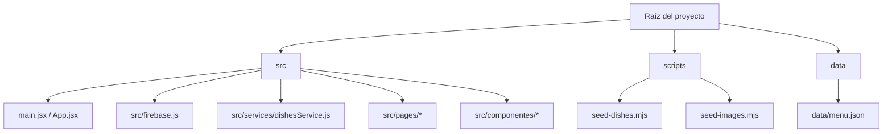
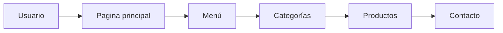

1) **Sinopsis general del proyecto**
- **Qué es:** `La Placita` es una aplicación web (SPA) para mostrar y administrar un menú de platillos.
- **Objetivo principal:** permitir a clientes ver el menú y a un administrador gestionar platillos sin desplegar un nuevo build.
- **Problema que soluciona:** facilita la actualización dinámica del menú y su publicación en línea.
- **Usuarios principales:** visitantes/clientes (consultan menú) y el administrador del negocio (gestiona platillos).

2) **Tecnologías utilizadas**
- **Lenguajes:** JavaScript (ESM), JSX (componentes React), CSS para estilos, JSON para datos estáticos.
- **React:** biblioteca para construir la interfaz con componentes reutilizables y manejo de estado.
- **Vite:** servidor de desarrollo y bundler rápido con HMR (hot module replacement) para desarrollo ágil.
- **Firebase / Firestore:** base de datos en tiempo real usada para persistir y sincronizar los documentos `dishes`.
- **Otras librerías:** `react-router-dom` (rutas), `react-toastify` (notificaciones), `@emailjs/browser` (envío de formularios desde el cliente).

Breve función de cada tecnología:
- `React`: renderiza UI y organiza la app en componentes.
- `Vite`: arranca servidor local y empaqueta para producción.
- `Firestore`: almacena platillos y notifica cambios en tiempo real.
- `CSS`: estilos visuales (archivo global y por componente).
- `JSON`: datos estáticos de respaldo en `data/menu.json`.

3) **Estructura general del proyecto (visual)**


4) **Funcionamiento del programa (paso a paso para el usuario)**
- **Inicio de la aplicación:** `npm run dev` arranca Vite; `main.jsx` monta React en el DOM.
- **Carga de React:** `App.jsx` define rutas con `react-router-dom` y renderiza la página actual.
- **Carga de componentes:** cada `Page` (por ejemplo `Menu.jsx`) importa y muestra componentes como `Navbar`, `MenuGrid` y `Footer`.
- **Navegación entre páginas:** React Router cambia componentes sin recargar la página completa.
- **Carga del menú:** `Menu.jsx` llama a `subscribeToDishes()` (en `src/services/dishesService.js`) que suscribe a la colección `dishes` en Firestore; los datos se pasan al estado y se renderizan.
- **Filtrado por categorías:** `Menu.jsx` mantiene `selectedCategory`; al cambiarlo se filtran los `dishes` visibles y se actualiza `MenuGrid`.
- **Visualización de productos:** `MenuGrid` renderiza `MenuCard` para cada platillo (nombre, descripción, precio, imagen si existe).
- **Formulario de contacto:** `ContactForm.jsx` utiliza `@emailjs/browser` para enviar mensajes desde el cliente (si está configurado).

5) **Cómo ejecutar el proyecto (instrucciones ordenadas)**
- **Requisitos previos:** Node.js 18+ y `npm`.
- **Instalar Node.js:** descarga e instala desde https://nodejs.org.
- **Pasos (en la carpeta del proyecto):**

```bash
npm install
npm run dev
```

- `npm run dev` abrirá Vite y mostrará en la terminal una URL local (por ejemplo `http://localhost:5173`). Abre esa URL en tu navegador.
- **Si aparece un error de dependencias:** intenta reinstalar dependencias, o limpia `node_modules` y `package-lock.json` y ejecuta `npm install` nuevamente:

```bash
rm -rf node_modules package-lock.json
npm install
```

- **Seeding de datos de ejemplo:**

```bash
npm run seed
```

- **Instrucción para imágenes:** antes de ejecutar `scripts/seed-images.mjs` edita `IMG_DIR` dentro del archivo para que apunte a una carpeta válida en tu sistema Linux, luego:

```bash
node scripts/seed-images.mjs
```

6) **Flujo del usuario (diagrama)**


- **Qué puede hacer el usuario en cada sección:**
	- **Página principal:** ver bienvenida y navegar.
	- **Menú:** explorar platillos, ver precios e imágenes.
	- **Categorías:** filtrar por tipo de platillo.
	- **Productos:** ver detalles y opciones (si se implementan).
	- **Contacto:** enviar mensaje al negocio.

7) **Administración del menú (cómo funciona hoy)**
- **Inicio de sesión admin:** `src/pages/AdminLogin.jsx` utiliza credenciales estáticas (`admin@laplacita.com` / `admin123`) y guarda `admin-auth` en `sessionStorage`.
- **Operaciones CRUD (implementadas):**
	- **Crear:** `createDish()` en `src/services/dishesService.js` usa `addDoc`.
	- **Editar:** `updateDish(id, dish)` usa `updateDoc`.
	- **Eliminar:** `deleteDish(id)` usa `deleteDoc`.
	- **Modificar precio / visibilidad / campos:** editar documento Firestore desde el admin.
- **Administrar imágenes:** actualmente el repositorio incluye `scripts/seed-images.mjs` que inserta `image` como data URI en documentos — esto funciona pero no es recomendado en producción (mejor usar Storage + URLs).
- **Validación:** la UI tiene validación básica; validaciones avanzadas y autenticación real son funcionalidad pendiente/recomendada.

8) **Descripción técnica**
- Aplicación SPA con React y `react-router-dom` que usa Firestore como fuente de datos en tiempo real.
- `Menu.jsx` se subscribe a `dishes` con `onSnapshot` y muestra los cambios automáticamente.
- El panel admin ejecuta operaciones CRUD mediante funciones en `src/services/dishesService.js`.
- Scripts de utilidad (`scripts/seed-dishes.mjs`, `scripts/seed-images.mjs`) permiten popular la base de datos para pruebas.

